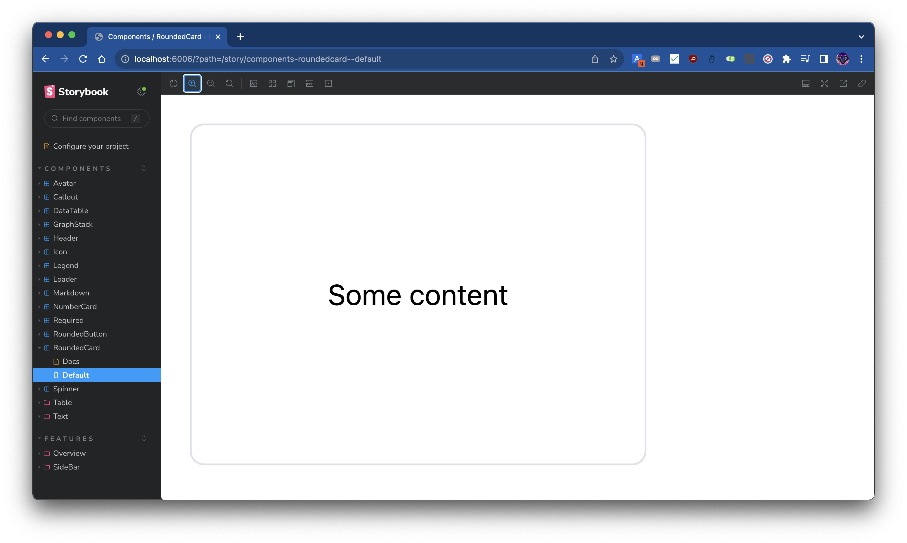
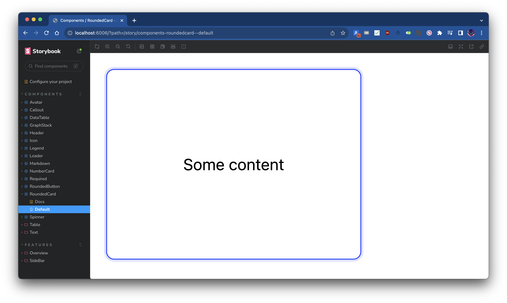

import Figure from "@site/src/components/Figure";

작성자는 [쉐퍼드23](https://shepherd23.com)의 Product Manager & Software Engineer로 재직하며
[카페24](https://www.cafe24.com/) 플랫폼을 대상으로 하는 Contextual Bandit 기반의
개인화 상품 추천 플러그인 [PickHound](https://store.cafe24.com/kr/apps/17367)의 개발 부문을 담당한 바가 있습니다. (See: [경력 기술서 - PickHound](/docs/career-description/pickhound))

작성자는 플러그인 개발의 일환으로, 쇼핑몰 관리자가 상품 추천 관련한 설정을 하고 구독 플랜을 관리할 수 있는 어드민 대시보드를 개발하였습니다.

이번 글에서는 이 중 "Admin Dashboard Kit" 디자인 시스템을 기반으로 어드민 대시보드 개발을 위한 디자인 시스템을 구현한 내용을 소개합니다.

<!-- truncate-->

## Admin Dashboard Kit

Admin Dashboard Kit은 [SaaS Design](https://www.saasdesign.io/)에서 제작한 어드민 대시보드를 위한 디자인 시스템으로, 커뮤니티 버전이 무료로 Figma File로 공개되어 있습니다. (See: [Figma Admin Dashboard Kit](https://www.saasdesign.io/figma-admin-dashboard-kit/))

작성자는 이 디자인 시스템을 참고하여, 본 플러그인의 어드민 대시보드를 개발했습니다.

<Figure
  src={require("./dashboard-main.png").default}
  alt="Dashboard Main"
  caption="어드민 대시보드 메인 페이지"
  appearance="flat"
/>

<Figure
  src={require("./dashboard-store.png").default}
  alt="Dashboard Store"
  caption="어드민 대시보드 기본 설정 페이지"
  appearance="flat"
/>

<Figure
  src={require("./dashboard-design.png").default}
  alt="Dashboard Design"
  caption="어드민 대시보드 상품 추천 배너 디자인 페이지"
  appearance="flat"
/>

## Implementation

아래에서는 어드민 대시보드를 개발하면서 작성한 주요 컴포넌트 및 오브젝트의 작성 동기와 구현 내용을 기술합니다.

### `<Avater />`

<Figure
  src={require("./avatar-set.png").default}
  alt="Avatar"
  appearance="flat"
/>

`<Avatar />` 컴포넌트는 대시보드의 상단에 위치한 사용자 정보를 표시하는 컴포넌트입니다. 이 컴포넌트는 여러 컴포넌트에서 재사용되지는 않지만, [Figma Admin Dashboard Kit](https://www.saasdesign.io/figma-admin-dashboard-kit/)에서 Header Bar 영역에 사용하기도 하고, 디자인의 구색을 맞추는 데에 이러한 Header Bar 영역이 필요했기에 구현하였습니다.

<details>
<summary>Avatar</summary>
<div markdown="1">

```tsx
import React from "react";
import clsx from "clsx";

interface Props {
  /**
   * Avatar source.
   * Should be Image URL.
   */
  src?: string;
  /**
   * The size of the avatar.
   * `size` decides border radius.
   * Border radius is half of the `size`.
   */
  size?: string;
  /**
   * Whether to apply ring or not. See [ring](https://tailwindcss.com/docs/ring-width#adding-a-ring)
   */
  ring?: boolean;
}

const borderRadius = (size: string) => {
  const scalar = Number.parseFloat(size);
  const unit = size.replace(scalar.toString(), "");
  return `${scalar / 2}${unit}`;
};

const defaultImageSrc = "/res/images/user.png";

/**
 * Common avatar UI implementation.
 */
const Avatar: React.FC<Props> = ({
  src = defaultImageSrc,
  size = "44px",
  ring,
}) => {
  return (
    <div
      className={clsx([
        "center overflow-hidden",
        ring && "ring ring-offset-2 ring-light-gray",
      ])}
      style={{ width: size, height: size, borderRadius: borderRadius(size) }}
    >
       {
          e.currentTarget.src = defaultImageSrc;
        }}
        alt="Avatar"
        className="bg-cover bg-center"
        style={{ width: size }}
      />
    </div>
  );
};

export default Avatar;
```

</div>
</details>

### `<Callout />`

<Figure
  src={require("./callout-info.png").default}
  alt="Callout Info"
  caption="Callout: Info"
/>

<Figure
  src={require("./callout-success.png").default}
  alt="Callout Success"
  caption="Callout: Success"
/>

<Figure
  src={require("./callout-warning.png").default}
  alt="Callout Warning"
  caption="Callout: Warning"
/>

<Figure
  src={require("./callout-error.png").default}
  alt="Callout Error"
  caption="Callout: Error"
/>

<Figure
  src={require("./callout-custom.png").default}
  alt="Callout Custom"
  caption="Callout: Custom Background Color"
/>

`<Callout />` 컴포넌트는 [Figma Admin Dashboard Kit](https://www.saasdesign.io/figma-admin-dashboard-kit/)에서 직접적으로 사용되지는 않지만, 개발 중 사용자에게 간단히 메시지를 전달하는데 이용할 수 있는 메시지 박스가 필요해 구현하였습니다.

컬러링에 디자인 시스템의 색상 팔레트를 사용해 다른 컴포넌트와의 일관성을 유지하여 이질감 없는 UI를 구현하고자 하였습니다.

직관적인 컴포넌트 구현으로 아래와 같이 간단하게 활용이 가능했고, 어드민 대시보드 곳곳에서 유저에게 메시지를 전달하는 데에 유용하게 사용되었습니다.

```tsx
<Callout appearance="info" truncate={50}>
  nulla autem mollitia voluptatibus quas expedita dolorem in possimus totam quam
  amet reprehenderit natus quos minima temporibus ex reprehenderit deleniti
  ullam dolorum voluptatem voluptas assumenda perspiciatis culpa consequuntur
  facere a
</Callout>
```

<details>
<summary>Callout</summary>
<div markdown="1">

```tsx
import React from "react";
import clsx from "clsx";
import Icon from "../icon";
import {
  CalloutAppearance,
  getBackgroundColor,
  getIconName,
  getTextColor,
} from "./utils";

interface Props {
  /**
   * @description
   * 배너의 색깔 및 leading 아이콘의 종류를 결정합니다. 각 옵션의 색깔 및 아이콘은 아래와 같습니다.
   *
   * - info: 파란색 배경; [info icon](https://fonts.google.com/icons?icon.query=info&icon.style=Rounded)
   * - success: 초록색 배경; [check_circle icon](https://fonts.google.com/icons?icon.query=check_circle&icon.style=Rounded)
   * - warning: 주황색 배경; [warning icon](https://fonts.google.com/icons?icon.query=warning&icon.style=Rounded)
   * - error: 빨간색 배경; [error icon](https://fonts.google.com/icons?icon.query=error&icon.style=Rounded)
   */
  appearance: CalloutAppearance;
  children?: React.ReactNode;
  /**
   * @description
   * children의 type이 @type {string}일 경우 적용됩니다.
   * children의 길이가 truncate를 초과할 경우 초과하는 문자열을 자르고 "..."을 붙입니다
   */
  truncate?: number;
  /**
   * @description
   * 배경색을 설정합니다.
   * 본 프로퍼티는 appearance 프로퍼티로 주어지는 배경색을 덮어씁니다.
   */
  backgroundColor?: string;
  /**
   * @description
   * 텍스트 색을 설정합니다.
   * 본 프로퍼티는 appearance 프로퍼티로 주어지는 텍스트 색을 덮어씁니다.
   */
  textColor?: string;
  className?: string;
}

/**
 * @description
 * 어떤 메시지를 강조하고 싶을때 사용하는 컴포넌트입니다.
 *
 * Banner라고도 불리우며, [Atlaskit의 배너](https://atlassian.design/components/banner/examples)
 * 를 참고하면 쉽게 이해할 수 있을 것입니다.
 */
const Callout: React.FC<Props> = ({
  children,
  appearance,
  truncate,
  backgroundColor = getBackgroundColor(appearance),
  textColor = getTextColor(appearance),
  className,
}) => {
  return (
    <div
      className={clsx([
        "flex justify-start items-center p-5 w-full",
        className,
      ])}
      style={{ backgroundColor }}
    >
      <Icon
        name={getIconName(appearance)}
        fontVariationSettings={{ FILL: 1 }}
        color={textColor}
      />
      <div className="h-full w-5" />
      {typeof children === "string" && truncate ? (
        <span style={{ color: textColor }}>
          {children.slice(0, truncate).concat("...")}
        </span>
      ) : (
        children
      )}
    </div>
  );
};

export default Callout;
```

</div>
</details>

### `<Icon />`

<Figure
  src={require("./icon-set.png").default}
  alt="Icon Set"
  appearance="flat"
/>

`<Icon />` 컴포넌트는 [Figma Admin Dashboard Kit](https://www.saasdesign.io/figma-admin-dashboard-kit/)에서 활용하는 아이콘을 [Google Icons](https://fonts.google.com/icons)로 구현할 적에 사용되었습니다. `React`의 Function Component 패턴을 이용해 아래와 같이 Google Icons를 편리하게 활용할 수 있도록 구현하였습니다.

```tsx
<Icon name="home" />
```

<details>
<summary>Icon</summary>
<div markdown="1">

```tsx
import React from "react";
import clsx from "clsx";
import type { Maybe } from "@src/utils/types";
import { FontVariationSettings, formatFontVariationSettings } from "./utils";

interface Props {
  /**
   * 구글 아이콘의 이름.
   *
   * 구글 아이콘의 이름은 [구글 아이콘](https://fonts.google.com/icons?icon.style=Rounded)에서 아이콘을 선택하면
   * 오른쪽에 표시되는 사이드바에서 "Inserting the icon" 부분의 span 태그의 innerText이다.
   */
  name: string;
  /**
   * Unit이 포함된 아이콘의 크기이다. (e.g. px, em, rem, ...)
   */
  size?: string;
  color?: Maybe<string>;
  className?: string;
  /**
   * [구글 아이콘](https://fonts.google.com/icons?icon.style=Rounded)에 들어가면
   * 우측에 Customization이라는 이름을 가진 floating banner가 있는데,
   * 여기에 있는 4개의 프로퍼티에 대응되는 값을 넣어주면 된다.
   */
  fontVariationSettings?: FontVariationSettings;
}

/**
 * @description
 * [구글 아이콘](https://fonts.google.com/icons?icon.style=Rounded)의 Wrapper Component.
 */
const Icon: React.FC<Props> = ({
  name,
  size: fontSize,
  color,
  className,
  fontVariationSettings,
}) => {
  return (
    <span
      className={clsx(["material-symbols-rounded", className])}
      style={{
        fontSize,
        color: color ?? undefined,
        fontVariationSettings: formatFontVariationSettings(
          fontVariationSettings,
        ),
      }}
    >
      {name}
    </span>
  );
};

export default Icon;
```

</div>
</details>

### `<Loader />`

<Figure src={require("./loader.png").default} alt="Loader" appearance="flat" />

`<Loader />` 컴포넌트는 [Figma Admin Dashboard Kit](https://www.saasdesign.io/figma-admin-dashboard-kit/)에서 사용하지는 않지만, 어드민 대시보드 곳곳에서 로딩 중임을 표시하는 데에 사용되었습니다.

API와 인증 Flow를 수행하기 위해 기다리거나 `<React.Suspense />` 컴포넌트의 `fallback` 등으로 여러 차례 사용되었습니다.

<details>
<summary>Loader</summary>
<div markdown="1">

```tsx
import colors from "@src/theme/colors";
import React from "react";
import { RotatingSquare } from "react-loader-spinner";
import clsx from "clsx";
import { useLoadingTextAnimation } from "@src/utils/hooks";
import Center from "../wrapper/center";

interface Props {
  /**
   * If true, the loader will be shown in full screen.
   *
   * It applies tailwindcss utility classes of `w-screen h-screen bg-cool-white` to the wrapper.
   */
  fullScreen?: boolean;
  /**
   * If true, the loader will be shown in full width and height.
   *
   * It applies tailwindcss utility classes of `w-full h-full` to the wrapper.
   */
  fill?: boolean;
  /**
   * Extra class names to apply to the wrapper.
   */
  className?: string;
}

/**
 * @description
 * Loader is a component that shows a loading animation.
 * This animation includes a rotating square
 * and a text that says "Loading" with trailing dots keep changing their number.
 */
const Loader: React.FC<Props> = ({ fullScreen, fill, className }) => {
  const animatedText = useLoadingTextAnimation();
  return (
    <Center
      direction="vertical"
      className={clsx([
        fullScreen && "w-screen h-screen bg-cool-white",
        fill && "w-full h-full",
        className,
      ])}
      fill
    >
      <RotatingSquare
        ariaLabel="rotating-square"
        visible
        color={colors.deepblue}
        strokeWidth="10"
      />
      <div className="w-1 h-6" />
      <h1 className="text-xl font-noto-sans-kr">{animatedText}</h1>
    </Center>
  );
};

export default Loader;
```

</div>
</details>

### `<NumberCard />`

<Figure
  src={require("./number-card.png").default}
  alt="Number Card"
  appearance="flat"
/>

`<NumberCard />` 컴포넌트는 [`<RoundedCard />`](#roundedcard-)를 활용해 구현한 컴포넌트로, [Figma Admin Dashboard Kit](https://www.saasdesign.io/figma-admin-dashboard-kit/)에서 사용되는 숫자를 표시하는 카드를 구현한 것입니다.

작성자가 개발한 어드민 대시보드에서는 메인 페이지에서 사용자에게 통계 정보를 제공하는 데에 사용되었습니다.

컴포넌트의 사용처가 매우 특정한 케이스로 제한된 경우로, 이러한 특성으로 아래와 같이 몇 개의 프로퍼티만 정의해도 바로 컴포넌트 사용이 가능합니다.

```tsx
<NumberCard title="Unresolved" value={60} />
```

<details>
<summary>NumberCard</summary>
<div markdown="1">

```tsx
import React from "react";
import clsx from "clsx";
import RoundedCard from "../rounded-card";
import Center from "../wrapper/center";
import Spinner from "../spinner";

interface Props {
  /**
   * 카드의 제목
   */
  title: string;
  /**
   * 제목에 대한 수치
   */
  value: number | string;
  /**
   * 수치를 로딩 중인지 표시할 때 사용
   */
  loading?: boolean;
  /**
   * 컴포넌트 루트 html tag에 적용할 id
   */
  id?: string;
  /**
   * 컴포넌트 루트 html tag에 적용할 className
   */
  className?: string;
  /**
   * `title`의 크기를 조절할 때 사용.
   * 'sm', 'lg' 중 하나를 선택할 수 있다.
   */
  size?: "sm" | "lg";
  /**
   * `value`의 크기를 조절할 때 사용.
   * 'sm', 'lg' 중 하나를 선택할 수 있다.
   */
  valueSize?: "sm" | "lg";
  /**
   * 컴포넌트 루트 html tag에 적용할 ref.
   * `React.Ref<HTMLDivElement>` 타입이다.
   */
  ref?: React.Ref<HTMLDivElement>;
}

/**
 * @description
 * 대시보드 첫 화면에서 실적 관련 통계를 표시할 때 사용하고 있는 컴포넌트.
 *
 * `title`인 이름을 위에 크게 표시하고 `value`인 수치를 `title`보다는 작게 아래에 표시하는 {@link RoundedCard}이다.
 *
 * [Dashboard Kit 의 디자인](https://www.figma.com/file/iXf4Zaj8CiD06LlknHpIRs/Figma-Admin-Dashboard-UI-Kit-(Community)?node-id=0%3A1&t=cPcff0XRaQTeWALD-1)을 참고하여 제작하였다.
 */
const NumberCard: React.FC<Props> = ({
  title,
  value,
  loading,
  id,
  className,
  ref,
  size = "lg",
  valueSize = "lg",
}) => {
  return (
    <RoundedCard
      ref={ref}
      id={id}
      className={clsx([
        size === "lg" ? "w-[258px] h-[134px]" : "w-24 h-18",
        className,
      ])}
    >
      <Center direction="vertical" fill>
        <span
          className={clsx([
            "text-ash-gray font-bold transition group-hover:text-deep-blue",
            size === "lg" ? "text-lg" : "text-xs",
            size === "lg" && "mb-2",
          ])}
        >
          {title}
        </span>
        <span
          className={clsx([
            "text-deep-black font-bold transition group-hover:text-deep-blue",
            size === "lg" && valueSize === "lg" ? "text-4xl" : "text-xl",
            size === "lg" && "mt-2",
          ])}
        >
          {loading && <Spinner />}
          {!loading && value.toString()}
        </span>
      </Center>
    </RoundedCard>
  );
};

export default NumberCard;
```

</div>
</details>

### `<Required />`

<Figure src={require("./required.png").default} alt="Required" />

`<Required />` 컴포넌트는 이름 그래도 어떤 필드가 Required 일 때를 나타내고자 할때 사용합니다. [Figma Admin Dashboard Kit](https://www.saasdesign.io/figma-admin-dashboard-kit/)에서도 위와 같은 디자인을 사용하고 있습니다.

`<Required />` 컴포넌트는 아래와 같이 텍스트를 감싸는 형태로 간단하게 사용할 수 있습니다.

```tsx
<Required>est distinctio</Required>
```

<details>
<summary>Required</summary>
<div markdown="1">

```tsx
import React from "react";
import clsx from "clsx";

interface Props {
  className?: string;
  children?: React.ReactNode;
}

/**
 * @description
 * Red asterisk aligned topleft for required fields
 */
const Required: React.FC<Props> = ({ children, className }) => {
  return (
    <div
      className={clsx([
        "text-deep-black flex justify-start items-start",
        className,
      ])}
    >
      <strong className="text-md align-top text-hotsauce">*</strong>
      {children}
    </div>
  );
};

export default Required;
```

</div>
</details>

### `<RoundedCard />`

|  |  |
| ---------------------------------- | ---------------------------------------------- |
| `RoundedCard`                      | `RoundedCard`: Hover 시                        |

`<RoundedCard />` 컴포넌트는 [Figma Admin Dashboard Kit](https://www.saasdesign.io/figma-admin-dashboard-kit/)의 기반을 이루는 컴포넌트로, 일정한 기능 단위를 카드로 묶고 기능 단위간의 경계를 나누는 역할을 합니다. 디자인 시스템 곳곳에서 활용됩니다.

이에 `<RoundedCard />` 컴포넌트를 구현하여, 어드민 대시보드 개발에 있어 도처에 사용할 수 있었습니다.

<details>
<summary>RoundedCard</summary>
<div markdown="1">

```tsx
import React from "react";
import clsx from "clsx";

interface Props {
  id?: string;
  className?: string;
  ref?: React.Ref<HTMLDivElement>;
  children: React.ReactNode;
}

/**
 * @description
 * A card with rounded corners and shadow.
 *
 * It has p-2 (padding of 0.5rem) property by default.
 * If you want to override, you can pass the className prop to do it.
 */
const RoundedCard: React.FC<Props> = ({ className, children, id, ref }) => {
  return (
    <div
      ref={ref}
      id={id}
      className={clsx([
        "group rounded-lg bg-white border border-light-gray hover:border-deep-blue hover:ring-2 hover:ring-dim-gray transition-all p-2",
        className,
      ])}
    >
      {children}
    </div>
  );
};

export default RoundedCard;
```

</div>
</details>

### `<RoundedButton />`

<Figure
  src={require("./rounded-button-set.png").default}
  alt="Rounded Button Set"
  appearance="flat"
/>

`<RoundedButton />` 컴포넌트는 `<RoundedCard />`와 함께 [Figma Admin Dashboard Kit](https://www.saasdesign.io/figma-admin-dashboard-kit/)의 기반을 이루는 컴포넌트로, Action을 수행하는 버튼의 역할을 합니다. 이 컴포넌트 또한 디자인 시스템 곳곳에서 활용됩니다.

이에 `<RoundedButton />` 컴포넌트를 구현하여, 역시 어드민 대시보드 개발에 있어 도처에 사용할 수 있었습니다.

<details>
<summary>RoundedButton</summary>
<div markdown="1">

```tsx
import clsx from "clsx";
import React, { useRef } from "react";
import colors from "@src/theme/colors";
import { useBoxLayout } from "@src/utils/hooks";
import Spinner from "../spinner";
import Center from "../wrapper/center";

interface Props {
  /**
   * Title of the button to display on the button.
   */
  title: string;
  /**
   * Function to call when the button is clicked.
   */
  onClick?: Maybe<() => void>;
  /**
   * Style of the button. There's two styles: `filled` and `outlined`.
   *
   * - `filled`: Button filled with `deep-blue` color.
   * - `outlined`: Button with border colored with `deep-blue` and no background color.
   *
   * See {@link theme} for more information related with color.
   */
  style?: "filled" | "outlined";
  /**
   * Additional class name to add to the button.
   */
  className?: string;
  /**
   * Same with `disabled` attribute of HTML button element.
   */
  disabled?: boolean;
  /**
   * Show loading spinner on the button if true.
   */
  loading?: boolean;
}

/**
 * Typical button with rounded corners.
 */
const RoundedButton: React.FC<Props> = ({
  title,
  onClick,
  className,
  disabled = false,
  style: buttonStyle = "filled",
  loading = false,
}) => {
  const boxRef = useRef<HTMLButtonElement>(null);
  const layout = useBoxLayout<HTMLButtonElement>({ boxRef });
  const style: React.CSSProperties = {
    minWidth: layout?.width,
    minHeight: layout?.height ?? 40,
  };
  const spinnerColor =
    buttonStyle === "filled" ? colors.coolwhite : colors.deepblue;
  return (
    <button
      style={style}
      ref={boxRef}
      type="button"
      disabled={disabled || loading}
      onClick={onClick ?? undefined}
      className={clsx([
        "py-2 px-4 text-sm rounded-md",
        buttonStyle === "filled" && "bg-deep-blue text-white hover:saturate-50",
        buttonStyle === "outlined" &&
          "border border-deep-blue text-deep-blue hover:bg-deep-blue hover:bg-opacity-10 hover:brightness-150",
        className,
      ])}
    >
      {!loading && title}
      {loading && (
        <Center fill>
          <Spinner color={spinnerColor} />
        </Center>
      )}
    </button>
  );
};

export default RoundedButton;
```

</div>
</details>

### Text: `<HeadingWithLine />`

<Figure
  src={require("./heading-with-line.png").default}
  alt="Heading With Line"
/>

`<HeadingWithLine />` 컴포넌트는 [Figma Admin Dashboard Kit](https://www.saasdesign.io/figma-admin-dashboard-kit/)에서 주요하게 사용되는 Header의 변형입니다. 이 컴포넌트는 특정 섹션의 제목을 표시할 때 사용합니다.

기존의 디자인 시스템의 Heading은 영어에 최적화되어 있어 한글의 경우에는 폰트 디자인의 이슈로 Heading이 뭔가 응집성이 없는 느낌을 주었습니다. 이에 한글에 최적화된 Heading을 구현하고자 하였고, 이를 위해 Heading 텍스트 앞에 선을 배치해 이 텍스트가 Heading임을 강조하게끔 디자인을 변경하였습니다.

컴포넌트의 사용처가 매우 특정한 케이스로 제한된 경우로, 이러한 특성으로 아래와 같이 몇 개의 프로퍼티만 정의해도 바로 컴포넌트 사용이 가능합니다.

```tsx
<HeadingWithLine title="HeadingWithLine" />
```

<details>
<summary>HeadingWithLine</summary>
<div markdown="1">

```tsx
import React from "react";

interface Props {
  title: string;
  id?: string;
}

/**
 * Title text with vertical line on the left.
 */
const HeadingWithLine: React.FC<Props> = ({ title, id }) => {
  return (
    <div id={id} className="flex justify-start items-center">
      <div className="w-1 h-7 bg-deep-black mr-2" />
      <span className="font-noto-sans-kr text-lg font-bold text-navy-blue">
        {title}
      </span>
    </div>
  );
};

export default HeadingWithLine;
```

</div>
</details>

### Wrapper: `<Center />`

`<Center />` 컴포넌트는 유틸리티 컴포넌트로, 자식 컴포넌트를 수평, 수직 중앙에 배치하는 역할을 합니다.

[Flutter](https://flutter.dev/)의 `Center` 위젯에서 영감을 받아 구현하였습니다.

<details>
<summary>Center</summary>
<div markdown="1">

```tsx
import React, { HTMLAttributes } from "react";
import clsx from "clsx";

interface Props extends HTMLAttributes<HTMLDivElement> {
  /**
   * @description
   * Prop for flex-direction.
   * If `horizontal`, then `flex-row` will be applied.
   * If `vertical`, then `flex-col` will be applied.
   */
  direction?: "horizontal" | "vertical";
  /**
   * @description
   * Prop for filling the parent element.
   * If `true`, then `w-full h-full` will be applied.
   */
  fill?: boolean;
}

/**
 * @description
 * `flex justify-center items-center` 속성이 미리 적용된 `div` 컴포넌트입니다.
 * prop으로는 기존 `div` 의 prop을 상속받으며, 여기에 `fill`, `direction` 프롭이 추가됩니다.
 */
const Center: React.FC<Props> = ({
  className,
  children,
  fill = false,
  direction = "horizontal",
  ...props
}) => {
  return (
    <div
      className={clsx([
        "flex justify-center items-center",
        direction === "vertical" && "flex-col",
        fill && "w-full h-full",
        className,
      ])}
      {...props}
    >
      {children}
    </div>
  );
};

export default Center;
```

</div>
</details>

### Wrapper: `<Container />`

`<Container />` 컴포넌트는 유틸리티 컴포넌트로, 자식 컴포넌트를 수직으로 나열하고, 수평으로는 가운데 정렬하는 역할을 합니다.

어드민 대시보드의 컨텐츠가 기본적으로 위에서 아래로 나열되는 형태로 구성되어 있어, 많은 컴포넌트에서 `<Container />` 컴포넌트를 Wrapper로 사용했고, 이를 통해 컴포넌트의 구조를 단순화할 수 있었습니다.

<details>
<summary>Container</summary>
<div markdown="1">

```tsx
/* eslint-disable react/require-default-props */
import React, { HTMLAttributes } from "react";
import clsx from "clsx";

interface Props extends HTMLAttributes<HTMLDivElement> {
  /**
   * @description
   * 만약 fill이 true라면, `w-full h-full` 속성이 추가됩니다.
   */
  fill?: boolean;
}

/**
 * @description
 * `flex flex-col justify-start items-center` 속성이 미리 적용된 `div` 컴포넌트입니다.
 * prop으로는 기존 `div` 의 prop을 상속받으며, 여기에 `fill` 프롭이 추가됩니다.
 */
const Container: React.FC<Props> = ({
  className,
  children,
  fill,
  ...props
}) => {
  return (
    <div
      className={clsx([
        "flex flex-col justify-start items-center",
        fill && "w-full h-full",
        className,
      ])}
      {...props}
    >
      {children}
    </div>
  );
};

export default Container;
```

</div>
</details>

### Theme: `colors`

`colors`는 [Figma Admin Dashboard Kit](https://www.saasdesign.io/figma-admin-dashboard-kit/)의 디자인 시스템에서 사용되는 색상 팔레트를 정의한 파일입니다.

이는 여러 컴포넌트에서 색상에 대한 참조가 필요할 때 사용되었으며, TailwindCSS의 `theme.extend.colors` 설정을 통해 utility class로도 사용할 수 있도록 구현하였습니다.

<details>
<summary>colors</summary>
<div markdown="1">

```ts
const colors = {
  coolwhite: "#F7F8FC",
  navyblue: "#363740",
  skyblue: "#DDE2FF",
  ashgray: "#9FA2B4",
  dullgray: "#A4A6B3",
  lightgray: "#DFE0EB",
  deepblue: "#3751FF",
  dimgray: "#DDE2FF",
  deepblack: "#252733",
  bluegray: "#F0F1F7",
  stalegray: "#C5C7CD",
  sunflower: "#FEC400",
  avocado: "#29CC97",
  hotsauce: "#F12B2C",
};

export default colors;
```

</div>
</details>

## Conclusion

이번 작업은, Figma로 작성된 디자인 시스템을 실제 React 코드로 구현하는 과정에서, 어떻게 하면 디자인 시스템의 가이드라인을 준수하면서 활용성과 재사용성이 높은 컴포넌트를 구현할 수 있을지에 대한 고민을 깊게 할 수 있었다는 데에서 그 의의가 있었다고 생각합니다.

또한 디자인 시스템의 구현으로 컴포넌트를 직접 작성하면서, 좋은 디자인 시스템은 단순하면서도 확장성이 뛰어난 구조를 가짐을 느낄 수 있었고, 이러한 단순하면서도 확장성이 뛰어난 코드 구조를 지향하는 것이 좋겠다는 생각을 하게 되었습니다.
