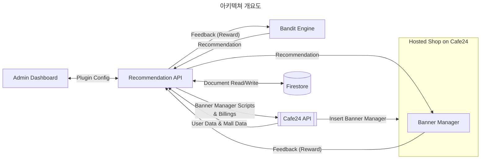

아래는 작성자가 PickHound 서비스의 개발 계획을 세우면서 작성한 아키텍쳐 개요도입니다.
아래의 아키텍쳐 구조는 현재까지도 대부분이 유지되고 있습니다.

```mermaid
---
title: 아키텍쳐 개요도
---
graph LR
  recommendation_api[Recommendation API]
  bandit_engine[Bandit Engine]
  cafe24_api[[Cafe24 API]]
  dashboard[Admin Dashboard]
  firestore[(Firestore)]
  subgraph shop [Hosted Shop on Cafe24]
    scripts[Banner Manager]
  end

  recommendation_api --> |"Feedback (Reward)"| bandit_engine
  bandit_engine --> |Recommendation| recommendation_api
  recommendation_api <--> |Document Read/Write| firestore
  dashboard <--> |Plugin Config| recommendation_api
  scripts --> |"Feedback (Reward)"| recommendation_api
  recommendation_api --> |Recommendation| scripts
  cafe24_api --> |User Data & Mall Data| recommendation_api
  recommendation_api --> |"Banner Manager Scripts
  & Billings"| cafe24_api
  cafe24_api --> |Insert Banner Manager| shop
```
