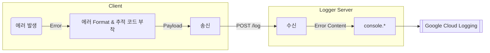

import Tags from "@site/src/components/Tag/Tags";
import values from "./values";

#### 심층 인터뷰를 통한 수요 파악 및 제품 방향성 수립

<Tags
  metadata={["general", "project-management-agnostic", "standbylab"]}
  tags={["project-management", "communication", "@shepherd23"]}
  tagColorScheme={values.tagColorScheme}
/>

- 약 1달에 걸쳐 다양한 분야에 종사하는 12명의 쇼핑몰 관리자를 대상으로 인터뷰 진행함.
- 인터뷰를 통한 피드백 수집으로 쇼핑몰의 규모에 따른 서비스의 수요, 운영 방식의 차이 등을 파악할 수 있었음.
- => 정리한 피드백을 바탕으로 불필요한 개발 단계는 제거하여 사내 자원의 소비를 최소화

:::tip

아래 링크에서 위와 관련한 더 자세한 내용을 확인할 수 있습니다.

https://01joseph-hwang10.github.io/posts/deep-interview

:::

#### 모노리포 구성, 패키지 버져닝 및 프로젝트 간 공통 모듈 공유

<Tags
  metadata={["general", "frontend-agnostic", "backend-agnostic"]}
  tags={["automation", "improvement", "@shepherd23"]}
  tagColorScheme={values.tagColorScheme}
/>

- Lerna, Python Module을 활용해 Monorepo 구성 (Recommendation API, Bandit Engine, Banner Manager)
- Lerna, `standard-version`을 활용한 패키지 버전 관리 (모든 프로젝트)
- 공유가 필요한 코드는 따로 패키지로 분리해 다른 리포지토리에서도 사용 가능하도록 구성 (Recommendation API, Banner Manager)
  - 공유 패키지 빌드 프로세스 구성 및 Github Actions, Google Artifact Registry를 활용해 자동 배포
  - => 비효율적인 복사 붙여넣기 방식의 코드 공유를 최소화.

##### Related

- [불필요한 코드 빌드 최소화](#불필요한-코드-빌드-최소화)

#### 불필요한 코드 빌드 최소화

<Tags
  metadata={["general", "frontend-agnostic", "backend-agnostic"]}
  tags={["optimization", "@shepherd23"]}
  tagColorScheme={values.tagColorScheme}
/>

- 대부분의 CI/CD 빌드 트리거가 Github Actions의 `push` 이벤트에 의해 발생함.
- 모노리포 상황에서 하나의 패키지에만 변경사항이 있는 경우에도 모든 패키지의 빌드가 발생하는 문제가 있었음.
- Lerna를 이용한 버저닝 관리와 함께 패키지 레지스트리에 배포되어 있는 패키지의 버전과 현재 레포지토리의 패키지 버전을 비교해 변경사항이 있는 경우에만 빌드가 발생하도록 구성함.
  - => 불필요한 빌드 최소화 및 CI/CD 자원 소비 최소화

<details>
<summary>publish_if_needed</summary>
<div markdown="1">

```bash
function publish_if_needed () {
  package_name="@$namespace/$1"
  package_dir="packages/$1"
  published_version=$(npm view $package_name version)
  current_version=$(node -pe "require('./package.json').version")
  if [ "$published_version" = "$current_version" ]; then
    echo "$package_name is already published"
  else
    echo "Publishing $package_name"
    npm publish -w $package_dir
  fi
}
```

</div>
</details>

#### Client Side 에러 트래킹을 위한 로깅 시스템 개발

<Tags
  metadata={["general", "frontend-agnostic"]}
  tags={["feature", "@shepherd23"]}
  tagColorScheme={values.tagColorScheme}
/>

- 서버에서 발생하는 에러와 달리 클라이언트 애플리케이션은 에러가 발생해도 팀 내에서는 인지하기 어려움.
- 고객의 오류 문의를 처리하기 위해서는 오류 당시의 자세한 상황을 알아야 하는데, 이를 고객의 설명에만 의존해 파악하기 어려움.
- 이에 Cloud Run에 POST request의 body를 `console.log` 를 통해 로깅하는 간단한 로그 서버와 이에 대한 클라이언트 라이브러리를 개발함.
  - 클라이언트는 `uuid` 를 활용해 고유의 에러 ID를 생성하고, 이를 로그 서버에 전송하며, 에러 ID를 에러 메시지와 함께 고객에게 전달.
  - 로그 서버는 Cloud Logging으로 로그를 스트림하고, 개발팀은 위에서 생성한 에러 ID를 통해 Cloud Logging에서 해당 에러를 검색.
- => 고객의 에러 문의에 발행된 에러 ID를 통해 즉각적인 문의 대응을 통한 고객 경험 향상.

<details>
<summary>에러 트래킹 시스템 개요도</summary>
<div markdown="1">



</div>
</details>

#### Jest, Pytest를 활용한 TDD로 개발 흐름 효율화

<Tags
  metadata={["general", "backend-agnostic"]}
  tags={["backend", "devops", "@shepherd23"]}
  tagColorScheme={values.tagColorScheme}
/>

- Jest, Pytest를 활용해 주요 엔드포인트 및 서비스 로직에 대한 Unit/E2E 테스트 작성.
- Insomnia 등의 툴을 이용한 수동 테스트 시보다 훨씬 효율적인 개발 흐름을 구성할 수 있었음
  - => 기존 수동으로 테스트를 진행했을 때와 비교해 작업 시간 약 90% 감소. (기존 약 20분 → TDD 도입 후 최대 2분)
  - => 다른 팀과 버그 수정 관련한 불필요한 대화가 오고 가는 빈도 약 80% 감소. (기존 평균 4 ~ 5회 → TDD 도입 후 0 ~ 1회)

#### 사내 내부 도큐멘테이션 배포를 위한 Private File Server 구축

<Tags
  metadata={["general", "frontend-agnostic", "backend-agnostic"]}
  tags={["backend", "devops", "@shepherd23"]}
  tagColorScheme={values.tagColorScheme}
/>

- 정적 웹페이지를 회사 내부 인원만 열람할 수 있도록 하는 Private File Server 구축.
- [static-webpage-with-auth](https://hub.docker.com/r/josephhwang02/static-webpage-with-auth) 로 도커라이즈 하여 여러 도큐멘테이션 페이지에 쉽게 적용할 수 있도록 만듬.

##### See Also

- static-webpage-with-auth: https://hub.docker.com/r/josephhwang02/static-webpage-with-auth

#### Google Sheets를 활용한 간이 어드민 대시보드 구축

<Tags
  metadata={["general", "frontend-agnostic", "backend-agnostic"]}
  tags={["feature", "@shepherd23"]}
  tagColorScheme={values.tagColorScheme}
/>

- NestJS는 Django처럼 Admin Dashboard를 제공하지 않고, Thrid Party 라이브러리 (e.g. AdminJS) 도 Firestore 를 DB로 사용하는 경우를 고려한 라이브러리는 없었음.
- 이에 Google Sheets, Sheets API, Cloud Functions 를 활용해 사용자 데이터 시각화 및 쇼핑몰 관리 기능을 포함하는 간이 대시보드 구축함.
- => UI 구현 필요 없이 간단한 로직 구현만 필요했기에 빠른 대시보드 구현이 가능했음.
- => 엑셀에 기반한 대시보드 구현으로 비개발 인원도 쉽게 지표를 확인하고 쇼핑몰을 관리할 수 있었음.

#### Cloud Logging & Slack을 활용한 에러 모니터링 시스템 구축

<Tags
  metadata={["general", "backend-agnostic"]}
  tags={["devops", "feature", "@shepherd23"]}
  tagColorScheme={values.tagColorScheme}
/>

- 에러 확인을 위해 주기적으로 GCP 대시보드에 접속하는 일이 매우 번거롭다는 문제가 있었음.
- 이에 GCL 로그 라우터와 Cloud Functions를 활용해 에러가 발생할 때마다 Slack으로 알림을 전송하는 시스템 구축함.
- => 에러 확인을 위해 주기적으로 GCP 대시보드에 접속하는 비효율 제거.
- 4XX 에러나 5XX 코드를 가지는 로그도 라우터에 포함되어 알림이 전송되는 문제가 있었음.
- GCL의 Logging Query Language 를 이용해 알림을 받을 필요가 없는 로그를 필터링하는 기능을 추가함.
- => 불필요한 알림 방지.

#### 코드주석과 Notion을 연계한 사내 도큐멘테이션 작성 효율화

<Tags
  metadata={["general", "backend-agnostic", "frontend-agnostic", "standbylab"]}
  tags={["devops", "improvement", "@shepherd23"]}
  tagColorScheme={values.tagColorScheme}
/>

- 기존에는 비개발 인원이 개발 상황을 파악하기 위해 개발자에게 직접 문의하거나, 개발자가 이미 코드 주석으로 작성된 내용을 Notion에 다시 작성하는 등의 비효율이 존재했음.
- 이에 Swagger, Typedoc, Sphinx 등의 툴을 활용해 도큐멘테이션을 생성하고, 노션 페이지와 도큐멘테이션 페이지의 웹 링크를 연계하는 도큐멘테이션 작성 컨벤션 수립.
- => 중복 작업 최소화로 작업의 효율성 향상
- [static-webpage-with-auth](https://hub.docker.com/r/josephhwang02/static-webpage-with-auth) 를 개발해 `Google Cloud Run`에 배포하여 사내 인원만 접근할 수 있도록 구성.
- => 비교적 적은 개발 자원 소비로 Netlify의 유료 솔루션 등을 사용하지 않고도 사내 인원만 접근할 수 있는 도큐멘테이션 페이지 구축.

##### See Also

- static-webpage-with-auth: https://hub.docker.com/r/josephhwang02/static-webpage-with-auth
- 사내 내부 도큐멘테이션 배포를 위한 Private File Server 구축: https://01joseph-hwang10.github.io/docs/career-description/pickhound#사내-내부-도큐멘테이션-배포를-위한-private-file-server-구축
